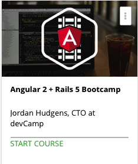

```
Roberto Nogueira  
BSd EE, MSd CE
Solution Integrator Experienced - Certified by Ericsson
```
# Angular 2 and Rails 5 Bootcamp



**About This Course**

Learn how to build a real world Angular 2 application that utilizes multiple Ruby on Rails apps for backend data APIs.

[Homepage](https://www.udemy.com/angular-on-rails-course/learn/v4/overview)

## Topics
```
Section: 1
0 / 5
Project Introduction
[x] 1. The Angular + Rails Application We're Going to Build 4:22
[x] 2. Application Architecture for an Angular + Rails Application 8:22
[x] 3. Monolith vs Microservice Architecture Deep Dive 10:33
[x] 4. The Role of Services in Microservice Architecture 8:32
[x] 5. The Role of Components in Microservices 6:55

Section: 2
0 / 2
System configuration for Angular 2 Application
[x] 6. Configuring a System to Run Angular 2 Applications 4:25
[x] 7. Generating an Angular 2 Application from Scratch 13:22

Section: 3
0 / 4
Angular 2 Development
[ ] 8. Hello Angular 2 23:05
[ ] 9. Working with Browser Sync 7:07
[ ] 10. Creating the App Component 11:56
[ ] 11. Introduction to Angular 2 Routing 14:59
[ ] 12. How to Create View Files in Angular 2 5:11

Section: 4
0 / 5
Building the Document Management Component
[ ] 13. Create a Document Management Component 7:28
[ ] 14. Creating Links Between Pages in Angular 5:51
[ ] 15. Creating an Angular Interface to Model Data 3:01
[ ] 16. Creating Mock Data in an Angular 2 Application 14:07
[ ] 17. How to Access Component Data from an Angular View Template 4:29

Section: 5
0 / 9
Building the Proposal Component
[ ] 18. Creating the Initial Proposal Component 7:25
[ ] 19. Creating an Angular 2 Data Model for Proposals 6:26
[ ] 20. Populating an Angular List View with Data 10:31
[ ] 21. Building an Angular 2 Component that will Create New Proposals 9:49
[ ] 22. Introduction to Angular 2 Forms 11:01
[ ] 23. Completing the Angular Proposal Form 18:28
[ ] 24. How to Implement Dynamic Data Validations in Angular 2 11:44
[ ] 25. Creating Dynamic Routes in Angular 2 Based on an ID Lookup 7:57
[ ] 26. How to Trigger 'Active' Classes in Angular 2 Views 13:15

Section: 6
0 / 15
Integrating Bootstrap 4 in an Angular 2 Application
[ ] 27. Installing Bootstrap 4 into an Angular 2 Application with ng-bootstrap 7:00
[ ] 28. How to Set Universal Styles in an Angular 2 Application 1:46
[ ] 29. Creating a Bootstrap 4 Navigation Bar 14:06
[ ] 30. How to Dynamically Add CSS Classes in an Angular 2 View 8:41
[ ] 31. Using Bootstrap Cards in an Angular Application 8:16
[ ] 32. Creating Angular 2 Component Specific CSS Files 7:28
[ ] 33. Setting Additional Global Styles for All Application Components in Angular 2 3:30
[ ] 34. How to Override the Default Bootstrap 4 Navigation Styles 7:26
[ ] 35. Adding Styles to an Angular 2 Form 8:59
[ ] 36. How to Style Dynamic Validation Messages in Angular 2 5:49
[ ] 37. How to Style Form Inputs with Bootstrap 4 Styles 4:49
[ ] 38. How to Integrate the List Group Component Styles in Angular 2 12:12
[ ] 39. How to Work with Angular 2 Pipes to Format Currencies 4:38
[ ] 40. Final Style Changes to Angular Application 5:11
[ ] 41. How to Add a Custom Font to an Angular 2 Application 2:22

Section: 7
0 / 3
Creating a Ruby on Rails Microservice to Manage Documents
[ ] 42. Generating a Rails 5 API Application from Scratch 10:01
[ ] 43. How to Generate Data in a Rails 5 Application 8:34
[ ] 44. How to Configure the Network Settings for a Rails API App 4:10

Section: 8
0 / 4
Connecting the Angular Front End with the Rails Document API App
[ ] 45. Creating an Angular 2 Service for Managing API Data 6:48
[ ] 46. Introduction to Angular 2 Observables 18:18
[ ] 47. How to Render API Data in an Angular 2 Application 16:04
[ ] 48. Analyzing Real Time Data Updates with an Angular + Rails System 4:49
[ ] 49. Final Style Changes to Angular 2 Document Component 2:35

Section: 9
0 / 2
Creating the Proposal Ruby on Rails Microservice API Application
[ ] 50. Building a Rails 5 API Microservice 2:29
[ ] 51. Using the Seeds File to Create Sample Data in a Rails 5 API App 12:26

Section: 10
0 / 5
Connecting the Angular 2 App with the Rails Proposal Microservice
[ ] 52. Using an Angular 2 Observable to Stream Live Data for the Proposal List Componen 16:07
[ ] 53. How to Implement an Angular 2 Show Page Component with API Data 19:18
[ ] 54. How to Build a Custom Link Function in an Angular 2 Component 4:54
[ ] 55. Creating an Angular 2 Form Submit Button 9:01
[ ] 56. How to Create New Records in a Rails API from an Angular App 18:06

Section: 11
0 / 6
Final Application Changes
[ ] 57. How to Add Dynamic Notifications in an Angular 2 Application 5:02
[ ] 58. Adding Final Style Changes to the Proposal Show Component 1:38
[ ] 59. How to Trigger Sending Emails from the Rails Microservice 13:51
[ ] 60. Angular 2 + Rails 5 Bootcamp Course Summary 1:57
```
